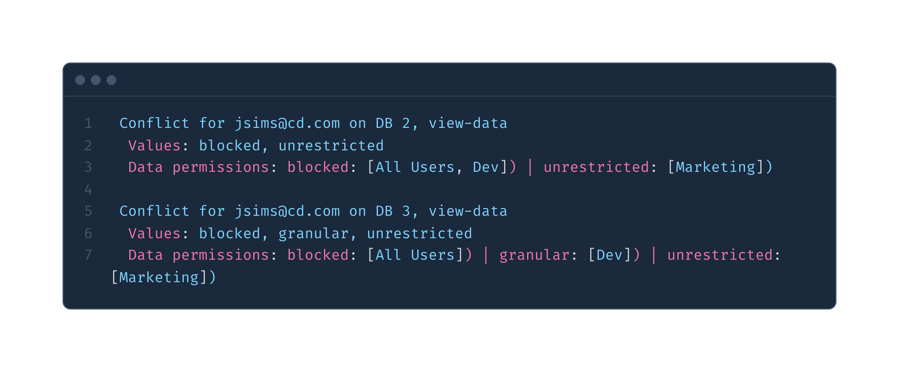

# Metabase API – Permissions Use Cases
Metabase's permissions model is powerful and can get complex fast, especially when a user belongs to multiple groups with different settings. For a deeper dive into how Metabase handles permissions across groups, collections, and databases, check out the official documentation:  
👉 [Understanding Permissions in Metabase](https://www.metabase.com/docs/latest/permissions/start)

This example demonstrates how to use the Metabase API to identify and resolve **conflicting data access permissions** between groups, databases, and collections.

---

## 📂 Folder Contents

- Script to fetch and compare permission mappings across groups, collections, and databases.  
👉 [`conflict.js`](https://github.com/FilmonK/metabase-api-examples/blob/main/permissions/conflicts.js)
---

## 🧪 What This Script Does

1. Authenticates with the Metabase API
2. Fetches all permission mappings for user accounts
3. Prints out effective permissions per group for each resource
4. Highlights overlapping or conflicting assignments

---

## 📸 Example Output

